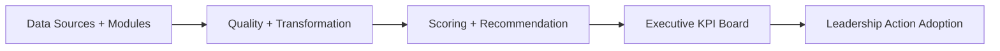
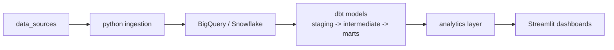
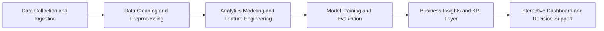

# Revenue-Intelligence-Platform-Suite

Flagship decision platform for Revenue and Retention leadership.

[](https://github.com/samuelmaia-analytics/revenue-intelligence-platform-suite/actions/workflows/ci.yml)
[](https://github.com/samuelmaia-analytics/revenue-intelligence-platform-suite/actions/workflows/publish-release.yml)
[](https://github.com/samuelmaia-analytics/revenue-intelligence-platform-suite/actions/workflows/showcase-monitoring.yml)
[](https://github.com/samuelmaia-analytics/revenue-intelligence-platform-suite/releases/tag/v1.0.0)

Public executive app (live): https://revenue-intelligence-platform.streamlit.app/

## Language
- English (canonical): [README.md](README.md)
- Portuguese (BR): [README.pt-BR.md](README.pt-BR.md)
- Portuguese (PT): [README.pt-PT.md](README.pt-PT.md)

## Why This Exists
Most portfolios show isolated analytics projects. This repository shows a production-minded platform:
- integrated modules in one monorepo
- executive decision layer with action prioritization
- shared contracts, CI, governance, and release cadence

## Official Showcase Use Case
Reduce B2B revenue churn by ranking retention actions by financial impact.
- Definition: [docs/showcase-use-case.md](./docs/showcase-use-case.md)
- Flagship app: `apps/executive-dashboard/app.py`
- Executive board: `apps/executive-dashboard/pages/1_Executive_KPI_Board.py`
- Modules portal: `apps/executive-dashboard/pages/2_Modules_Access.py`

## Executive Questions This Platform Answers
1. Which accounts have the highest revenue-at-risk this week?
2. Which action should leadership execute first?
3. What recovery and ROI are expected under each scenario?

## Architecture


## Modern Data Stack Architecture


This architecture is implemented in the `modules/revenue-intelligence` module, with an optional warehouse loading step and a complete dbt project.

## Analytics Architecture


This architecture represents the analytical pipeline, end-to-end data flow, and analytics decision layer used by the platform.

## Monorepo Structure
```text
revenue-intelligence-platform-suite/
|- apps/                     # executive and operational apps
|- modules/                  # integrated portfolio repositories
|- platform/                 # platform architecture namespaces
|- platform_connectors/      # runtime-safe telemetry connectors
|- platform_observability/   # runtime-safe observability services
|- packages/common/          # shared contracts and utilities
|- reports/showcase/         # generated showcase artifacts
|- docs/                     # architecture, governance, proof, releases
`- tests/                    # root validation and smoke tests
```

## Core Modules
- [modules/revenue-intelligence](./modules/revenue-intelligence)
- [modules/churn-prediction](./modules/churn-prediction)
- [modules/analise-vendas-python](./modules/analise-vendas-python)
- [modules/amazon-sales-analysis](./modules/amazon-sales-analysis)
- [modules/data-senior-analytics](./modules/data-senior-analytics)

## Portfolio Navigation
Use this section to quickly evaluate what each module proves in business terms.

| Module | What this project proves |
|---|---|
| [modules/revenue-intelligence](./modules/revenue-intelligence) | End-to-end revenue retention system design, from telemetry-backed KPI board to prioritized executive actions. |
| [modules/churn-prediction](./modules/churn-prediction) | Churn-risk modeling quality with temporal validation and deployable scoring workflow. |
| [modules/analise-vendas-python](./modules/analise-vendas-python) | Commercial analytics depth in Python with KPI storytelling for sales leadership. |
| [modules/amazon-sales-analysis](./modules/amazon-sales-analysis) | Retail/e-commerce diagnostics and revenue leakage identification with reproducible analysis. |
| [modules/data-senior-analytics](./modules/data-senior-analytics) | Senior-level analytics framing: translating data outputs into executive decisions and tradeoffs. |

## Production-Grade Baseline
- Enterprise-like telemetry connector: SQLite mock with connector interface
- Contract testing: shared schemas in `packages/common/contracts`
- Observability: action adoption events logged to CSV and JSONL
- CI: root checks + per-module matrix + executive app smoke test

## Business Metrics
Example KPIs analyzed in the project:
- Revenue Growth Rate
- Customer Lifetime Value (CLV)
- Customer Churn Rate
- Average Order Value (AOV)
- Conversion Rate

Business metrics help organizations understand performance trends and support data-driven decision making.

## Analytics Workflow
1. Data collection and ingestion
2. Data cleaning and preprocessing
3. Exploratory data analysis (EDA)
4. Feature engineering
5. Machine learning model training
6. Model evaluation
7. Business insights generation
8. Interactive dashboard development

## Project Highlights
- End-to-end analytics workflow
- Interactive analytics dashboard
- Business-oriented metrics
- Predictive analytics model
- Structured project architecture

## Quick Start (2 steps)
1. Generate showcase artifacts:
```bash
python scripts/run_showcase_demo.py
```
2. Launch the executive app:
```bash
streamlit run apps/executive-dashboard/app.py
```

Modern Data Stack demo (single command):
```powershell
powershell -ExecutionPolicy Bypass -File .\modules\revenue-intelligence\scripts\run_modern_data_stack_demo.ps1
```

dbt lineage docs are publishable via GitHub Pages using `.github/workflows/dbt-docs.yml`.
Setup guide: [docs/dbt-docs-publishing.md](./docs/dbt-docs-publishing.md)
Published docs URL: https://samuelmaia-analytics.github.io/revenue-intelligence-platform-suite/
CI guardrail: `dbt-parse` job in `.github/workflows/ci.yml`

### Expected Outputs
- `reports/showcase/summary.json`
- `reports/showcase/enterprise_telemetry.sqlite`
- `reports/showcase/top_actions.csv`

### Where to Click in the App
- Click `Open Executive KPI Board` on the home page.
- Review `Leadership Actions This Week`.
- Use `Action Adoption Monitoring` to log outcomes by `action_id`.

## Evidence and Governance
- [docs/proof.md](./docs/proof.md)
- [docs/executive-brief.md](./docs/executive-brief.md)
- [docs/kpi-scorecard.md](./docs/kpi-scorecard.md)
- [docs/governance-raci.md](./docs/governance-raci.md)
- [docs/compliance-checklist.md](./docs/compliance-checklist.md)
- [CONTRIBUTING.md](./CONTRIBUTING.md)
- [SECURITY.md](./SECURITY.md)

## Release Cadence
- Current release: `v1.0.0` (March 5, 2026)
- Release notes: [docs/releases/v1.0.0.md](./docs/releases/v1.0.0.md)
- Quarterly notes: [docs/releases/2026-Q1.md](./docs/releases/2026-Q1.md)

## Realized Business Deltas by Release
| Release | Realized delta published | Evidence |
|---|---|---|
| `v1.0.0` | Executive prioritization moved from static mock insights to telemetry-backed decisioning; quantified current exposure at `$144,490.04` total revenue at risk and `$29,130.33` in top-50 priority accounts. | [docs/releases/v1.0.0.md](./docs/releases/v1.0.0.md), [reports/showcase/summary.json](./reports/showcase/summary.json) |
| `2026-Q1` | Platform operating baseline established for repeatable quarterly reporting (contracts, CI matrix, observability logs). Action adoption tracking is now live, with first quarter baseline of `0` recorded events. | [docs/releases/2026-Q1.md](./docs/releases/2026-Q1.md), [reports/showcase/action_adoption_metrics.json](./reports/showcase/action_adoption_metrics.json) |

## Next Milestones
1. Replace SQLite mock with live enterprise warehouse/API connectors.
2. Add automated drift monitoring for model and KPI quality.
3. Publish action-outcome deltas each quarter with accepted/in-progress adoption evidence.
