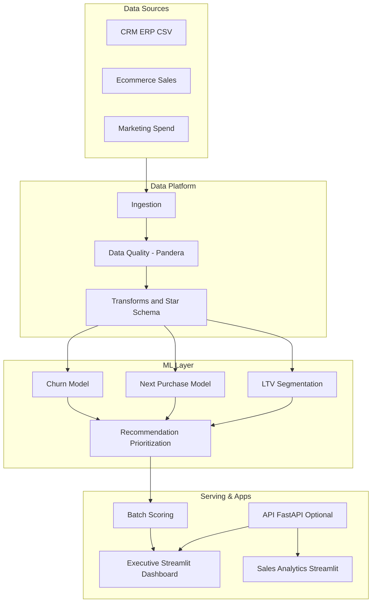
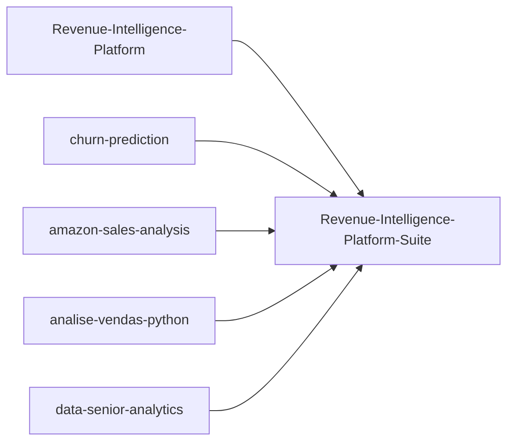

# Revenue-Intelligence-Platform-Suite

Unified Revenue + Retention Intelligence platform, consolidating data engineering, analytics, and ML into one modular monorepo.

## Language
- English: [README.md](README.md)
- Portugues (BR): [README.pt-BR.md](README.pt-BR.md)
- Portugues (PT): [README.pt-PT.md](README.pt-PT.md)

## Summary
- [What This Is](#what-this-is)
- [Live Executive Demo](#live-executive-demo)
- [Platform Architecture](#platform-architecture)
- [How Repositories Compose The Platform](#how-repositories-compose-the-platform)
- [Modules](#modules)
- [Monorepo Layout](#monorepo-layout)
- [Executive Docs](#executive-docs)
- [Quickstart](#quickstart)
- [Subtree Update Example](#subtree-update-example)
- [Business Outcomes](#business-outcomes)
- [Tech Stack](#tech-stack)

## What This Is

- Layered architecture: `raw -> bronze -> silver -> gold`
- Business models: churn, next purchase, LTV, and prioritization
- Executive and operational applications with Streamlit
- Technical governance: data contracts, testing, and CI

## Live Executive Demo

- Executive Dashboard (flagship app): `apps/executive-dashboard/app.py`
- Revenue Intelligence demo: https://revenue-intelligence-platform.streamlit.app/
- Data Senior Analytics demo: https://data-analytics-sr.streamlit.app
- Sales Analytics demo: https://analys-vendas-python.streamlit.app/

## Platform Architecture



## How Repositories Compose The Platform



## Modules

| Module Path | Source Repository | Status |
|---|---|---|
| [modules/revenue-intelligence](./modules/revenue-intelligence) | Revenue-Intelligence-Platform-End-to-End-Analytics-ML-System | Integrated via subtree |
| [modules/churn-prediction](./modules/churn-prediction) | churn-prediction | Integrated via subtree |
| [modules/amazon-sales-analysis](./modules/amazon-sales-analysis) | amazon-sales-analysis | Integrated via subtree |
| [modules/analise-vendas-python](./modules/analise-vendas-python) | analise-vendas-python | Integrated via subtree |
| [modules/data-senior-analytics](./modules/data-senior-analytics) | data-senior-analytics | Integrated via subtree |

## Monorepo Layout

```text
revenue-intelligence-platform-suite/
|- apps/
|- datasets/
|- docs/
|- modules/
|- packages/
|- platform/
|- tests/
`- pyproject.toml
```

## Executive Docs

- [Executive Brief](./docs/executive-brief.md)
- [KPI Scorecard](./docs/kpi-scorecard.md)

## Quickstart

```bash
python -m venv .venv
.venv\Scripts\Activate.ps1
pip install -e ".[dev]"
streamlit run apps/executive-dashboard/app.py
```

## Subtree Update Example

```bash
git fetch churn-prediction main
git subtree pull --prefix modules/churn-prediction churn-prediction main --squash
```

## Business Outcomes

- Better prioritization for high-value and high-risk customers
- Faster retention and revenue-growth decisions
- Reproducible pipelines and model traceability

## Tech Stack

Python, SQL, Streamlit, scikit-learn, Prefect, Pandera, MLflow, Pytest, Docker.

