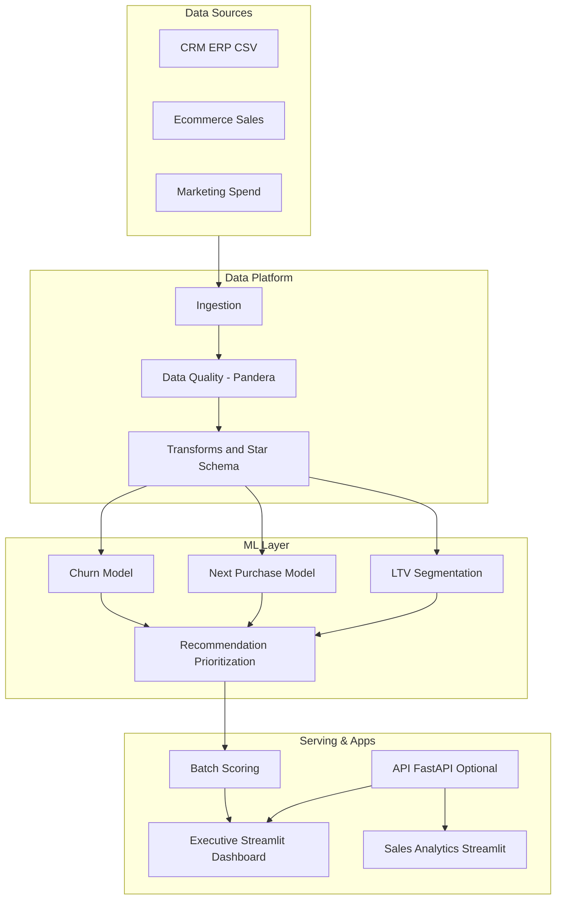

# Customer Intelligence Platform Suite

Plataforma unica de Revenue + Retention Intelligence, consolidando engenharia de dados, analytics e ML em um monorepo modular.

## What This Is

- Arquitetura em camadas: `raw -> bronze -> silver -> gold`
- Modelos de negocio: churn, next purchase, LTV e priorizacao
- Aplicacoes executivas e operacionais com Streamlit
- Governanca tecnica: contratos de dados, testes e CI

## Platform Architecture



## How Repositories Compose The Platform


## Modules

| Module Path | Source Repository | Status |
|---|---|---|
| [modules/revenue-intelligence](./modules/revenue-intelligence) | Revenue-Intelligence-Platform-End-to-End-Analytics-ML-System | Integrated via subtree |
| [modules/churn-prediction](./modules/churn-prediction) | churn-prediction | Integrated via subtree |
| [modules/amazon-sales-analysis](./modules/amazon-sales-analysis) | amazon-sales-analysis | Integrated via subtree |
| [modules/analise-vendas-python](./modules/analise-vendas-python) | analise-vendas-python | Integrated via subtree |
| [modules/data-senior-analytics](./modules/data-senior-analytics) | data-senior-analytics | Integrated via subtree |

## Monorepo Layout

```text
revenue-intelligence-platform-suite/
|- apps/
|- datasets/
|- docs/
|- modules/
|- packages/
|- platform/
|- tests/
`- pyproject.toml
```

## Executive Docs

- [Executive Brief](./docs/executive-brief.md)
- [KPI Scorecard](./docs/kpi-scorecard.md)

## Quickstart

```bash
python -m venv .venv
.venv\Scripts\Activate.ps1
pip install -e ".[dev]"
streamlit run apps/executive-dashboard/app.py
```

## Subtree Update Example

```bash
git fetch churn-prediction main
git subtree pull --prefix modules/churn-prediction churn-prediction main --squash
```

## Business Outcomes

- Melhor priorizacao de clientes de alto valor e alto risco
- Acoes mais rapidas de retencao e crescimento de receita
- Reproducibilidade de pipeline e rastreabilidade de modelo

## Tech Stack

Python, SQL, Streamlit, scikit-learn, Prefect, Pandera, MLflow, Pytest, Docker.
