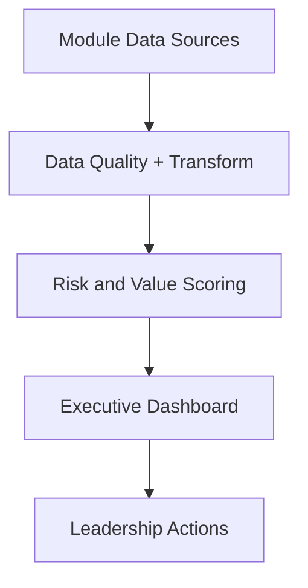

# Revenue-Intelligence-Platform-Suite

Operating system for Revenue and Retention decisions.

## Language
- English: [README.md](README.md)
- Portugues (BR): [README.pt-BR.md](README.pt-BR.md)
- Portugues (PT): [README.pt-PT.md](README.pt-PT.md)

## Why This Exists

Most analytics portfolios show isolated projects. This platform demonstrates an integrated decision system:

- data pipeline reliability
- model-driven prioritization
- executive action board
- governance and traceability

## Official Showcase Use Case

Reduce B2B revenue churn by prioritizing retention actions with financial impact.

- Full definition: [Showcase Use Case](./docs/showcase-use-case.md)
- Live app: `https://revenue-intelligence-platform-suite.streamlit.app/`

## Executive Questions Answered

1. Which accounts have the highest revenue at risk this week?
2. What action should leadership execute first?
3. How much revenue can be recovered under each scenario?

## Product Architecture



## Core Modules

- [revenue-intelligence](./modules/revenue-intelligence)
- [churn-prediction](./modules/churn-prediction)
- [analise-vendas-python](./modules/analise-vendas-python)

Supporting modules remain integrated for portfolio coverage.

## Run in 2 Steps

1. Generate showcase artifacts:
```bash
python scripts/run_showcase_demo.py
```

2. Launch executive app:
```bash
streamlit run apps/executive-dashboard/app.py
```

## Evidence and Proof

- [Proof of Execution](./docs/proof.md)
- [Executive Brief](./docs/executive-brief.md)
- [KPI Scorecard](./docs/kpi-scorecard.md)
- [Governance RACI](./docs/governance-raci.md)
- [Security Policy](./SECURITY.md)
- [Compliance Checklist](./docs/compliance-checklist.md)

## Current Maturity

- Monorepo integration: complete
- Executive dashboard (real module data): complete
- Governance baseline: complete
- Production operationalization with live enterprise sources: next phase

## Next Milestones

1. Replace proxy KPIs with production telemetry.
2. Add automated drift and action adoption monitoring.
3. Publish quarterly release notes with business deltas.
