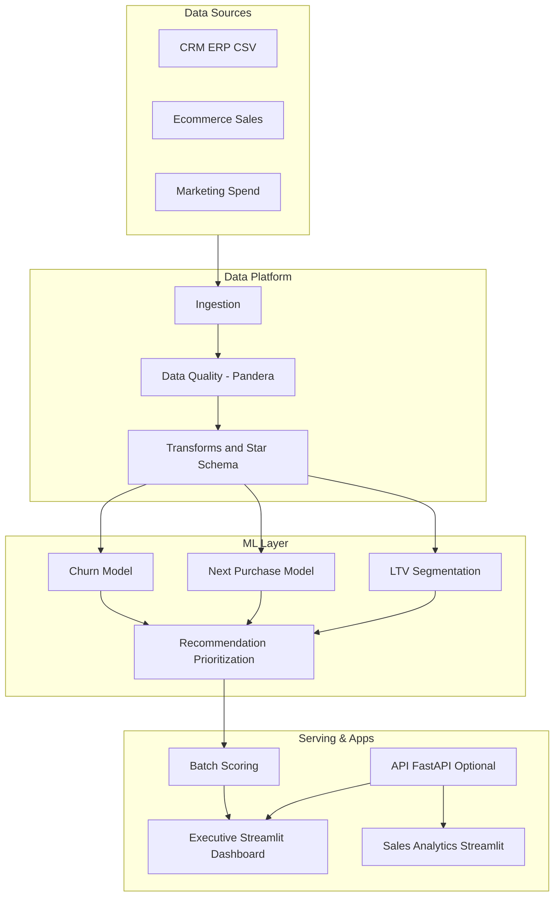
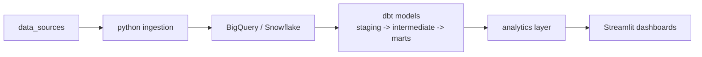
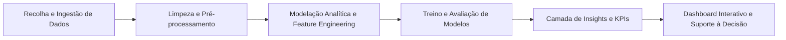
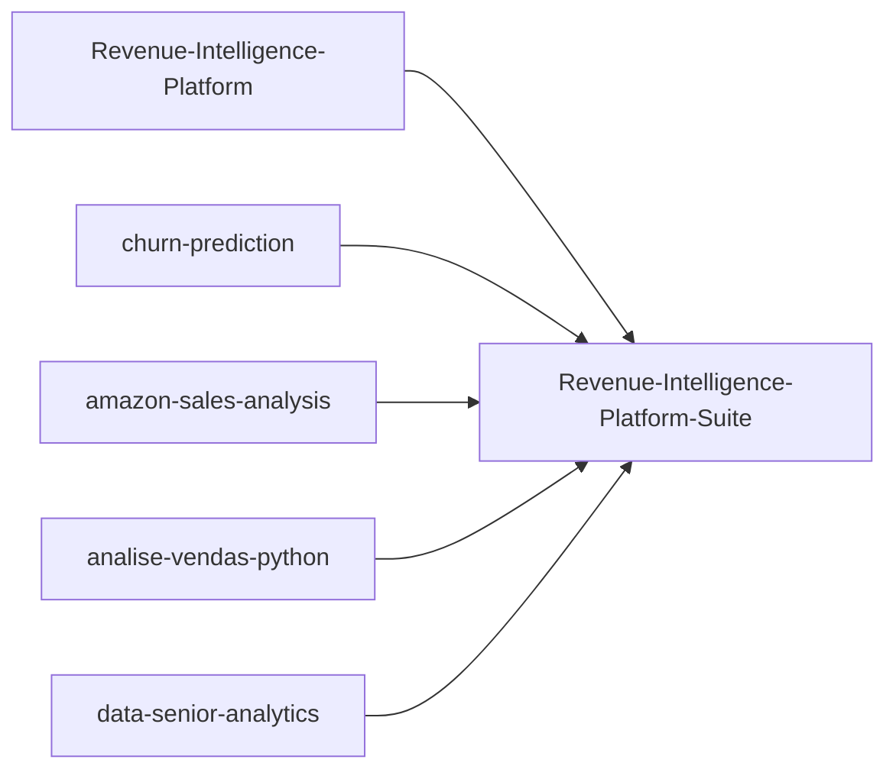

# Revenue-Intelligence-Platform-Suite

Plataforma flagship de decisão para Revenue e Retention.
Este ficheiro é a tradução em Português (PT) do README canonical em inglês.

[](https://github.com/samuelmaia-analytics/revenue-intelligence-platform-suite/actions/workflows/ci.yml)
[](https://github.com/samuelmaia-analytics/revenue-intelligence-platform-suite/actions/workflows/publish-release.yml)
[](https://github.com/samuelmaia-analytics/revenue-intelligence-platform-suite/actions/workflows/showcase-monitoring.yml)
[](https://github.com/samuelmaia-analytics/revenue-intelligence-platform-suite/releases/tag/v1.0.0)

App executiva pública (live): https://revenue-intelligence-platform.streamlit.app/

## Idioma
- English: [README.md](README.md)
- Português (BR): [README.pt-BR.md](README.pt-BR.md)
- Português (PT): [README.pt-PT.md](README.pt-PT.md)

## Sumário
- [O Que É](#o-que-e)
- [Estado da Vitrine](#estado-da-vitrine)
- [Demo Executiva](#demo-executiva)
- [Arquitetura da Plataforma](#arquitetura-da-plataforma)
- [Arquitetura Modern Data Stack](#arquitetura-modern-data-stack)
- [Arquitetura de Analytics](#arquitetura-de-analytics)
- [Como os Repositórios Compõem a Plataforma](#como-os-repositorios-compoem-a-plataforma)
- [Módulos](#modulos)
- [Navegação de Portfólio](#navegacao-de-portfolio)
- [Estrutura do Monorepo](#estrutura-do-monorepo)
- [Documentos Executivos](#documentos-executivos)
- [Governança e Segurança](#governanca-e-seguranca)
- [Casos de Uso](#casos-de-uso)
- [Quickstart](#quickstart)
- [Atualização de Subtree](#atualizacao-de-subtree)
- [Resultados de Negócio](#resultados-de-negocio)
- [Deltas de Negócio por Release](#deltas-de-negocio-por-release)
- [Métricas de Negócio](#metricas-de-negocio)
- [Workflow de Analytics](#workflow-de-analytics)
- [Destaques do Projeto](#destaques-do-projeto)
- [Stack Tecnológica](#stack-tecnologica)

## O Que É

- Arquitetura em camadas: `raw -> bronze -> silver -> gold`
- Modelos de negócio: churn, next purchase, LTV e priorização
- Aplicações executivas e operacionais com Streamlit
- Governança técnica com contratos de dados, testes e CI

## Estado da Vitrine

- README canonical internacional em inglês: [README.md](README.md)
- Release atual: `v1.0.0` (2026-03-05)
- Notas de release: [docs/releases/v1.0.0.md](./docs/releases/v1.0.0.md)
- Notas trimestrais: [docs/releases/2026-Q1.md](./docs/releases/2026-Q1.md)

## Demo Executiva

- Dashboard executivo (app flagship): `apps/executive-dashboard/app.py`
- Demo Revenue Intelligence: https://revenue-intelligence-platform.streamlit.app/
- Demo Data Senior Analytics: https://data-analytics-sr.streamlit.app
- Demo Sales Analytics: https://analys-vendas-python.streamlit.app/

## Arquitetura da Plataforma



## Arquitetura Modern Data Stack



Implementacao no modulo `modules/revenue-intelligence`, com carga opcional em warehouse e projeto `dbt` completo.

## Arquitetura de Analytics



Esta arquitetura representa o pipeline analítico, o fluxo de dados end-to-end e a camada de decisão de analytics usada pela plataforma.

## Como os Repositórios Compõem a Plataforma



## Módulos

| Caminho do Modulo | Repositorio de Origem | Estado |
|---|---|---|
| [modules/revenue-intelligence](./modules/revenue-intelligence) | Revenue-Intelligence-Platform-End-to-End-Analytics-ML-System | Integrado via subtree |
| [modules/churn-prediction](./modules/churn-prediction) | churn-prediction | Integrado via subtree |
| [modules/amazon-sales-analysis](./modules/amazon-sales-analysis) | amazon-sales-analysis | Integrado via subtree |
| [modules/analise-vendas-python](./modules/analise-vendas-python) | analise-vendas-python | Integrado via subtree |
| [modules/data-senior-analytics](./modules/data-senior-analytics) | data-senior-analytics | Integrado via subtree |

## Navegação de Portfólio

Esta secção acelera a leitura para recrutadores e liderança, tornando explícito o valor que cada módulo demonstra.

| Módulo | O que este projeto demonstra |
|---|---|
| [modules/revenue-intelligence](./modules/revenue-intelligence) | Capacidade de desenhar um sistema completo de retenção de receita com priorização executiva baseada em impacto financeiro. |
| [modules/churn-prediction](./modules/churn-prediction) | Qualidade de modelação preditiva de churn com validação temporal e fluxo de scoring aplicável. |
| [modules/amazon-sales-analysis](./modules/amazon-sales-analysis) | Diagnóstico analítico de e-commerce e identificação reproduzível de perdas de receita. |
| [modules/analise-vendas-python](./modules/analise-vendas-python) | Profundidade em analytics comercial com storytelling orientado para decisão de vendas. |
| [modules/data-senior-analytics](./modules/data-senior-analytics) | Maturidade em analytics sénior: transformar achados técnicos em decisão executiva e trade-offs de negócio. |

## Estrutura do Monorepo

```text
revenue-intelligence-platform-suite/
|- apps/
|- datasets/
|- docs/
|- modules/
|- packages/
|- platform/
|- tests/
`- pyproject.toml
```

## Documentos Executivos

- [Executive Brief](./docs/executive-brief.md)
- [KPI Scorecard](./docs/kpi-scorecard.md)
- [Governance RACI](./docs/governance-raci.md)

## Governança e Segurança

- [CODEOWNERS](./.github/CODEOWNERS)
- [Security Policy](./SECURITY.md)
- [Compliance Checklist (LGPD/GDPR)](./docs/compliance-checklist.md)

## Casos de Uso

- [Case Study 01 - Churn Retention Prioritization](./docs/case-studies/case-study-01-churn-retention-prioritization.md)
- [Case Study 02 - Discount Leakage Revenue Recovery](./docs/case-studies/case-study-02-discount-leakage-revenue-recovery.md)

## Quickstart

```bash
python -m venv .venv
.venv\Scripts\Activate.ps1
pip install -e ".[dev]"
streamlit run apps/executive-dashboard/app.py
```

Demo Modern Data Stack (1 comando):

```powershell
powershell -ExecutionPolicy Bypass -File .\modules\revenue-intelligence\scripts\run_modern_data_stack_demo.ps1
```

Publicacao de docs dbt no GitHub Pages:
- Workflow: `.github/workflows/dbt-docs.yml`
- Guia: [docs/dbt-docs-publishing.md](./docs/dbt-docs-publishing.md)
- URL publicada: https://samuelmaia-analytics.github.io/revenue-intelligence-platform-suite/
- Validacao no CI: job `dbt-parse` em `.github/workflows/ci.yml`

## Atualização de Subtree

```bash
git fetch churn-prediction main
git subtree pull --prefix modules/churn-prediction churn-prediction main --squash
```

## Resultados de Negócio

- Melhor priorização de clientes de elevado valor e elevado risco
- Decisões mais rápidas para retenção e crescimento de receita
- Reprodutibilidade de pipelines e rastreabilidade de modelos

## Deltas de Negócio por Release

| Release | Delta de negócio publicado | Evidência |
|---|---|---|
| `v1.0.0` | Priorização executiva passou de insights estáticos para decisão orientada por telemetria; exposição atual quantificada em `$144,490.04` de receita em risco e `$29,130.33` no top-50 de contas prioritárias. | [docs/releases/v1.0.0.md](./docs/releases/v1.0.0.md), [reports/showcase/summary.json](./reports/showcase/summary.json) |
| `2026-Q1` | Base operacional da plataforma consolidada para reporte trimestral recorrente (contratos, CI em matriz, logs de observabilidade). O rastreio de adoção está ativo, com baseline inicial de `0` eventos no trimestre. | [docs/releases/2026-Q1.md](./docs/releases/2026-Q1.md), [reports/showcase/action_adoption_metrics.json](./reports/showcase/action_adoption_metrics.json) |

## Métricas de Negócio

Example KPIs analyzed in the project:
- Revenue Growth Rate
- Customer Lifetime Value (CLV)
- Customer Churn Rate
- Average Order Value (AOV)
- Conversion Rate

Business metrics help organizations understand performance trends and support data-driven decision making.

## Workflow de Analytics

1. Data collection and ingestion
2. Data cleaning and preprocessing
3. Exploratory data analysis (EDA)
4. Feature engineering
5. Machine learning model training
6. Model evaluation
7. Business insights generation
8. Interactive dashboard development

## Destaques do Projeto

- End-to-end analytics workflow
- Interactive analytics dashboard
- Business-oriented metrics
- Predictive analytics model
- Structured project architecture

## Stack Tecnológica

Python, SQL, Streamlit, scikit-learn, Prefect, Pandera, MLflow, Pytest, Docker.
