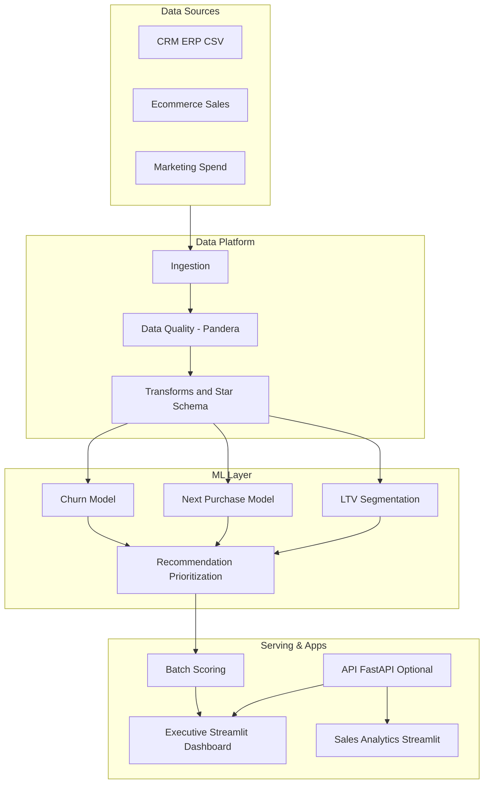
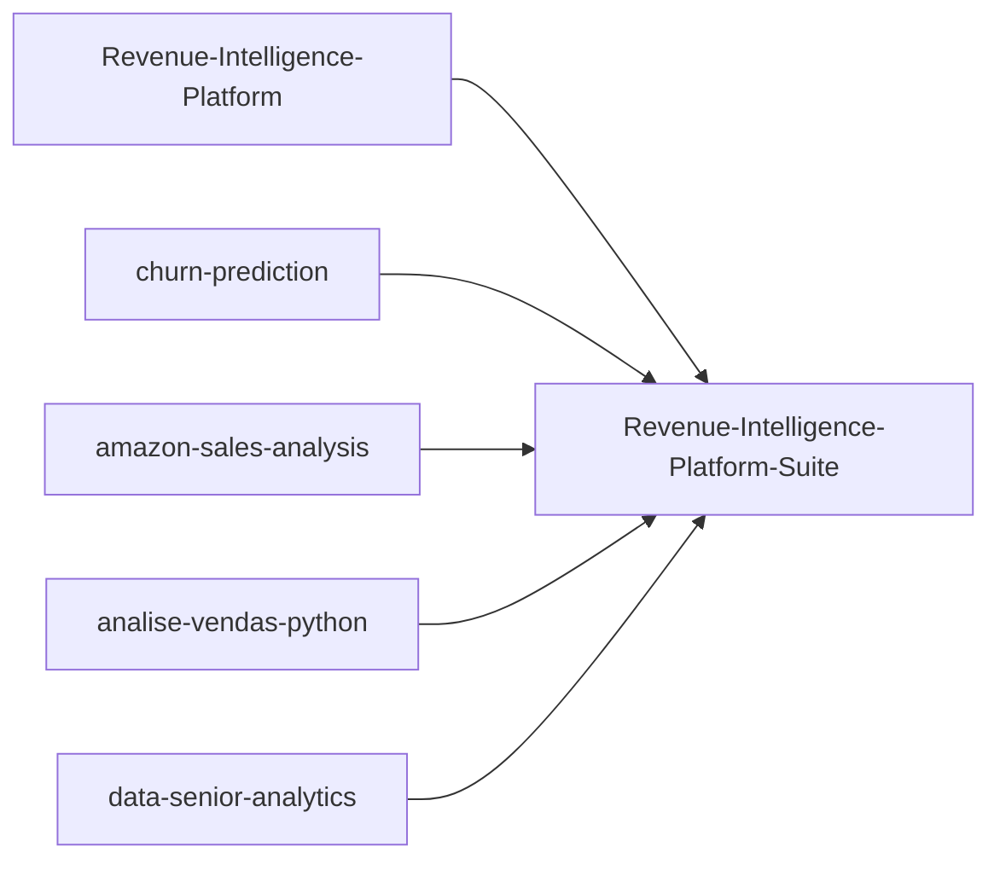

# Revenue-Intelligence-Platform-Suite

Plataforma flagship de decisao para Revenue e Retention.
Este ficheiro e a traducao em Portugues (PT) do README canonical em ingles.

[](https://github.com/samuelmaia-data-analyst/revenue-intelligence-platform-suite/actions/workflows/ci.yml)
[](https://github.com/samuelmaia-data-analyst/revenue-intelligence-platform-suite/actions/workflows/publish-release.yml)
[](https://github.com/samuelmaia-data-analyst/revenue-intelligence-platform-suite/actions/workflows/showcase-monitoring.yml)
[](https://github.com/samuelmaia-data-analyst/revenue-intelligence-platform-suite/releases/tag/v1.0.0)

## Idioma
- English: [README.md](README.md)
- Portugues (BR): [README.pt-BR.md](README.pt-BR.md)
- Portugues (PT): [README.pt-PT.md](README.pt-PT.md)

## Sumario
- [O Que E](#o-que-e)
- [Estado da Vitrine](#estado-da-vitrine)
- [Demo Executiva](#demo-executiva)
- [Arquitetura da Plataforma](#arquitetura-da-plataforma)
- [Como os Repositorios Compoem a Plataforma](#como-os-repositorios-compoem-a-plataforma)
- [Modulos](#modulos)
- [Estrutura do Monorepo](#estrutura-do-monorepo)
- [Documentos Executivos](#documentos-executivos)
- [Governanca e Seguranca](#governanca-e-seguranca)
- [Casos de Uso](#casos-de-uso)
- [Quickstart](#quickstart)
- [Atualizacao de Subtree](#atualizacao-de-subtree)
- [Resultados de Negocio](#resultados-de-negocio)
- [Stack Tecnologica](#stack-tecnologica)

## O Que E

- Arquitetura em camadas: `raw -> bronze -> silver -> gold`
- Modelos de negocio: churn, next purchase, LTV e priorizacao
- Aplicacoes executivas e operacionais com Streamlit
- Governanca tecnica com contratos de dados, testes e CI

## Estado da Vitrine

- README canonical internacional em ingles: [README.md](README.md)
- Release atual: `v1.0.0` (2026-03-05)
- Notas de release: [docs/releases/v1.0.0.md](./docs/releases/v1.0.0.md)
- Notas trimestrais: [docs/releases/2026-Q1.md](./docs/releases/2026-Q1.md)

## Demo Executiva

- Dashboard executivo (app flagship): `apps/executive-dashboard/app.py`
- Demo Revenue Intelligence: https://revenue-intelligence-platform.streamlit.app/
- Demo Data Senior Analytics: https://data-analytics-sr.streamlit.app
- Demo Sales Analytics: https://analys-vendas-python.streamlit.app/

## Arquitetura da Plataforma



## Como os Repositorios Compoem a Plataforma



## Modulos

| Caminho do Modulo | Repositorio de Origem | Estado |
|---|---|---|
| [modules/revenue-intelligence](./modules/revenue-intelligence) | Revenue-Intelligence-Platform-End-to-End-Analytics-ML-System | Integrado via subtree |
| [modules/churn-prediction](./modules/churn-prediction) | churn-prediction | Integrado via subtree |
| [modules/amazon-sales-analysis](./modules/amazon-sales-analysis) | amazon-sales-analysis | Integrado via subtree |
| [modules/analise-vendas-python](./modules/analise-vendas-python) | analise-vendas-python | Integrado via subtree |
| [modules/data-senior-analytics](./modules/data-senior-analytics) | data-senior-analytics | Integrado via subtree |

## Estrutura do Monorepo

```text
revenue-intelligence-platform-suite/
|- apps/
|- datasets/
|- docs/
|- modules/
|- packages/
|- platform/
|- tests/
`- pyproject.toml
```

## Documentos Executivos

- [Executive Brief](./docs/executive-brief.md)
- [KPI Scorecard](./docs/kpi-scorecard.md)
- [Governance RACI](./docs/governance-raci.md)

## Governanca e Seguranca

- [CODEOWNERS](./.github/CODEOWNERS)
- [Security Policy](./SECURITY.md)
- [Compliance Checklist (LGPD/GDPR)](./docs/compliance-checklist.md)

## Casos de Uso

- [Case Study 01 - Churn Retention Prioritization](./docs/case-studies/case-study-01-churn-retention-prioritization.md)
- [Case Study 02 - Discount Leakage Revenue Recovery](./docs/case-studies/case-study-02-discount-leakage-revenue-recovery.md)

## Quickstart

```bash
python -m venv .venv
.venv\Scripts\Activate.ps1
pip install -e ".[dev]"
streamlit run apps/executive-dashboard/app.py
```

## Atualizacao de Subtree

```bash
git fetch churn-prediction main
git subtree pull --prefix modules/churn-prediction churn-prediction main --squash
```

## Resultados de Negocio

- Melhor priorizacao de clientes de elevado valor e elevado risco
- Decisoes mais rapidas para retencao e crescimento de receita
- Reprodutibilidade de pipelines e rastreabilidade de modelos

## Stack Tecnologica

Python, SQL, Streamlit, scikit-learn, Prefect, Pandera, MLflow, Pytest, Docker.
