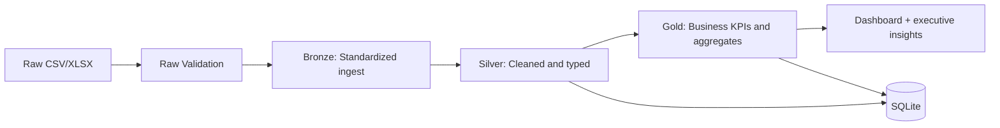
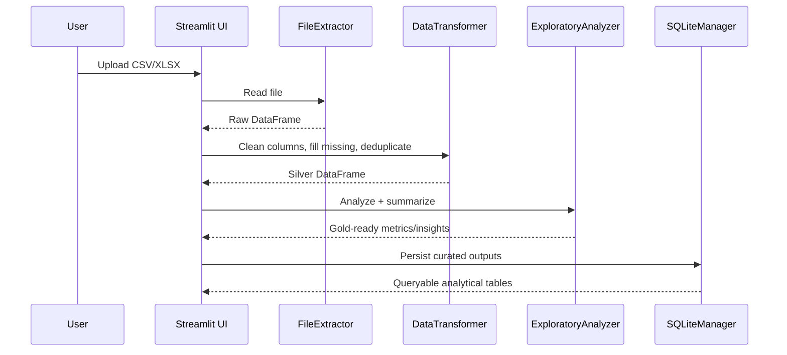

# Architecture

## Executive Summary
The project follows a layered analytics architecture to keep business UI concerns separate from data processing and persistence.

## Layered Approach
- Presentation layer: `dashboard/app.py` and `dashboard/utils/*` for UX, charts, and KPI communication.
- Application layer: orchestration inside the Streamlit flow (upload, validation, pipeline execution).
- Domain analytics layer: `src/analysis/exploratory.py` and `src/data/transformer.py` for statistical logic and transformations.
- Data access layer: `src/data/file_extractor.py` and `src/data/sqlite_manager.py` for ingestion and persistence.
- Platform/config layer: `config/settings.py`, `config/data_source.yaml`, and validation scripts.

## End-to-End Flow

## Runtime Sequence

## Evidence of Engineering Discipline
- CI gate: lint + format + tests + coverage (`>=70%`).
- Data contract and output contract tests for predictable Gold outputs.
- ADR folder to document architecture decisions.
- Structured runtime logs with trace id and per-page timing in dashboard runtime.
- Data manifest checksum validation to prevent unnoticed dataset drift.
