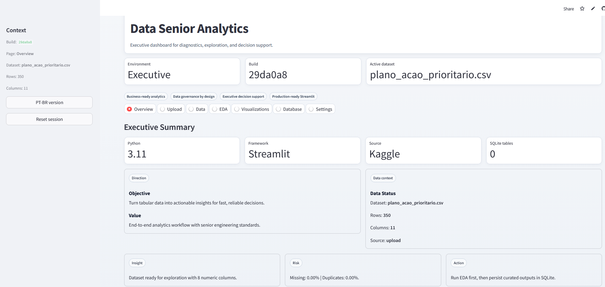
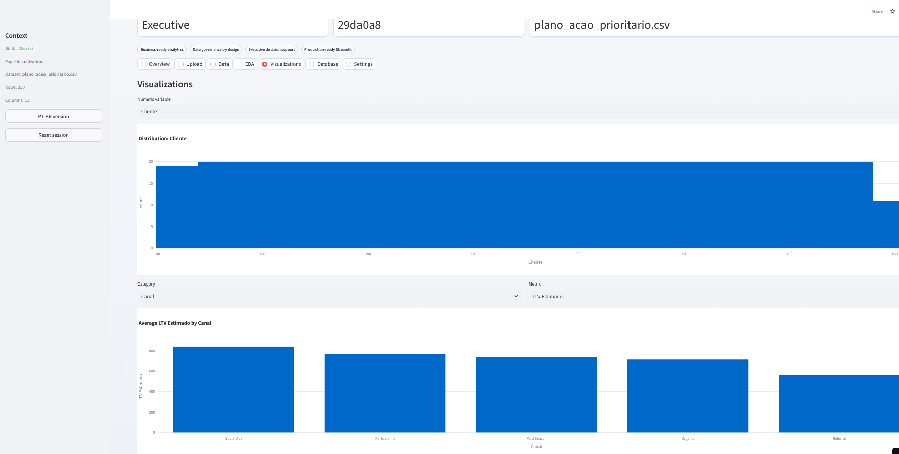

> This repository is part of the **Customer Intelligence Platform**
> Main platform: ../../README.md

# Data Senior Analytics

[English version](README.en.md)

[](https://github.com/samuelmaia-data-analyst/data-senior-analytics/actions/workflows/ci.yml)
[](https://codecov.io/gh/samuelmaia-data-analyst/data-senior-analytics)
[](LICENSE)
[](https://www.python.org/downloads/)

Business-focused analytics project that turns raw tabular files into decision-ready insights with a reproducible pipeline and interactive dashboard.

Live demo: https://data-analytics-sr.streamlit.app

## Executive Summary
- Problem: teams depend on slow spreadsheet workflows and non-standard analysis quality.
- Approach: layered pipeline (`raw -> bronze -> silver -> gold`) with ingestion, transformation, EDA, and dashboard delivery.
- Results: CI-gated analytics repo with data governance, output contracts, and reproducible execution.

## Impact
- Metrics: CI automation enforces lint + format + tests + coverage (`>=70%`) on every PR.
- Assumptions: input is CSV/XLSX from business users, with mixed quality and partial missing values.
- Outcomes: faster insight turnaround with stable output schema for dashboard and stakeholder consumption.

## Screenshots / Demo



## Architecture Proof
- Layered architecture and flow: [docs/ARCHITECTURE.md](docs/ARCHITECTURE.md)
- Architecture decision record (ADR): [docs/adr/0001-architecture-decision.md](docs/adr/0001-architecture-decision.md)
- Data contract (`raw/bronze/silver/gold`): [docs/DATA_CONTRACT.md](docs/DATA_CONTRACT.md)
- Data provenance: [docs/DATA_PROVENANCE.md](docs/DATA_PROVENANCE.md)
- Data lineage manifest: [docs/DATA_LINEAGE.md](docs/DATA_LINEAGE.md)

## Reproducible Run
```bash
git clone https://github.com/samuelmaia-data-analyst/data-senior-analytics.git
cd data-senior-analytics
python -m venv .venv
# Linux/macOS
source .venv/bin/activate
# Windows PowerShell
.venv\Scripts\Activate.ps1

make setup
make lint
make test
make run
```

## Environment Variables
Copy `.env.example` to `.env` and adjust values for your environment.

| Variable | Required | Purpose |
|---|---|---|
| `AWS_ACCESS_KEY_ID` | No | Optional AWS integration |
| `AWS_SECRET_ACCESS_KEY` | No | Optional AWS integration |
| `AWS_REGION` | No | AWS region (default: `us-east-1`) |
| `S3_BUCKET_NAME` | No | Bucket used for external persistence |
| `DATA_PATH` | No | Local data root |
| `LOG_LEVEL` | No | Application logging level |

## Quality and Engineering
- `pytest-cov` with coverage gate (`>=70%`)
- `ruff` + `black` + optional `mypy` via pre-commit
- Secret scanning and manifest drift checks in CI
- Gold output contract tests under `tests/`

## Release Management
- Changelog: [CHANGELOG.md](CHANGELOG.md)
- Release notes: see [CHANGELOG.md](CHANGELOG.md).

## License
Licensed under MIT. See [LICENSE](LICENSE).

## Where it fits in the platform
- Layer: Pipeline + App + Quality
- Inputs: Business CSV/XLSX datasets from operational teams
- Outputs: Decision-ready insights, curated datasets, governance-checked dashboard outputs


