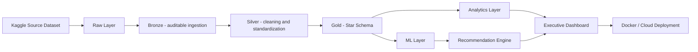
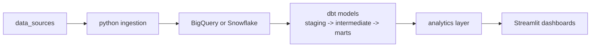
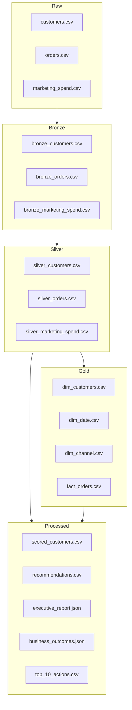
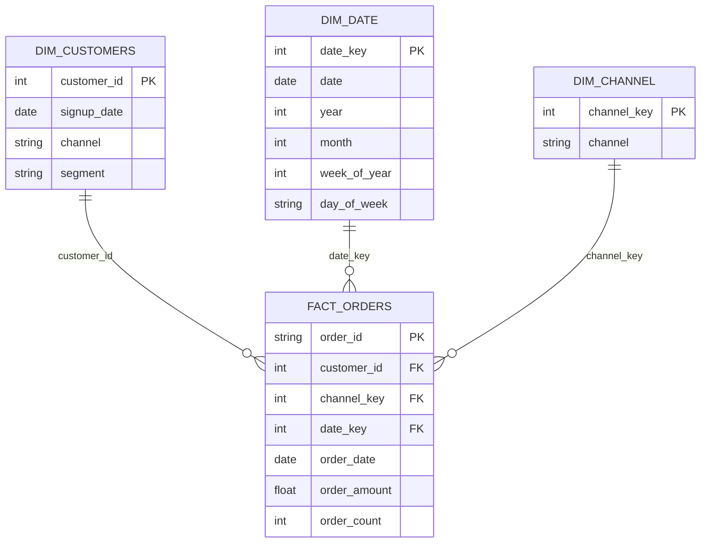
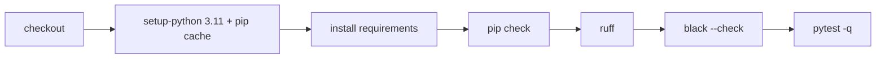

> This repository is part of the **Revenue-Intelligence-Platform-Suite**
> Main platform: ../../README.md

# Revenue Intelligence Platform - Executive Analytics & ML System

[](https://www.python.org/)
[](https://streamlit.io/)
[](https://scikit-learn.org/)
[](https://www.docker.com/)
[](LICENSE)

## Language
- English: [README.md](README.md)
- Portugues (BR): [README.pt-BR.md](README.pt-BR.md)
- Portugues (PT): [README.pt-PT.md](README.pt-PT.md)

## Product Preview


## What Problem It Solves

- Commercial teams need one prioritized view of who to retain, upsell, or deprioritize.
- Finance and growth need transparent unit economics (`LTV/CAC`) by channel to reallocate spend fast.
- Leadership needs a single weekly board pack with KPI trends, risk signals, and top actions.

## Summary

- [Product Preview](#product-preview)
- [What Problem It Solves](#what-problem-it-solves)
- [Live App](#live-app)
- [Executive Summary](#executive-summary)
- [Business Outcomes](#business-outcomes)
- [Scope and Capabilities](#scope-and-capabilities)
- [Architecture](#architecture)
- [Modern Data Stack Architecture](#modern-data-stack-architecture)
- [Data Lineage](#data-lineage)
- [Repository Structure](#repository-structure)
- [Data Source](#data-source)
- [Star Schema (Gold)](#star-schema-gold)
- [SQL Organization](#sql-organization)
- [Local Run (Windows / PowerShell)](#local-run-windows--powershell)
- [One-Command Demo](#one-command-demo)
- [CLI](#cli)
- [Engineering Quality](#engineering-quality)
- [CI](#ci)
- [Docker](#docker)
- [Main Outputs](#main-outputs)
- [Streamlit Cloud](#streamlit-cloud)

## Live App

Streamlit Cloud:
- https://revenue-intelligence-platform.streamlit.app/

## Executive Summary

Revenue Intelligence Platform is an end-to-end decision system that converts customer behavior data into commercial priorities.

This version includes a mature layered data architecture (`raw -> bronze -> silver -> gold`) with a formal Star Schema and structured SQL domains for analytics.
It also includes a Modern Data Stack path (`python ingestion -> warehouse -> dbt -> analytics layer -> Streamlit`).

## Business Outcomes

- Prioritized customer action list with estimated financial impact
- Channel efficiency visibility with `LTV/CAC` and unit economics
- Customer-level churn risk and next purchase probability
- Executive narrative for weekly business reviews

## Scope and Capabilities

- Data ingestion from Kaggle source with synthetic fallback
- Layered pipeline: raw, bronze, silver, gold
- Feature engineering and customer-level scoring
- Star schema outputs for analytics interoperability
- KPI layer: LTV, CAC, RFM, Cohort Retention, Unit Economics
- ML layer: churn + next purchase prediction
- Recommendation engine for next best action
- Executive Streamlit dashboard with governance and exports
  (`Executive Overview`, `Risk & Growth`, `Action List`)
- Structured SQL domains (`ddl/` and `analytics/`)

## Architecture



## Modern Data Stack Architecture



### What was added

- `dbt/` project with layered models (`staging`, `intermediate`, `marts`)
- Optional warehouse loader in Python pipeline for `BigQuery` and `Snowflake`
- Configurable runtime via environment variables for warehouse target and credentials

## Data Lineage



## Repository Structure

```text
revenue-intelligence-platform/
|- app/
|  \- streamlit_app.py
|- data/
|  |- raw/
|  |- bronze/
|  |- silver/
|  |- gold/
|  \- processed/
|- notebooks/
|- src/
|- sql/
|  |- ddl/
|  \- analytics/
|- dbt/
|  |- models/staging/
|  |- models/intermediate/
|  \- models/marts/
|- main.py
|- requirements.txt
|- requirements-dev.txt
|- requirements-dbt.txt
|- requirements-warehouse.txt
|- pytest.ini
|- Dockerfile
|- README.md
\- README.pt-BR.md
```

## Data Source

Primary file:
- `data/raw/E-commerce Customer Behavior - Sheet1.csv`

Source:
- Kaggle dataset: `E-commerce Customer Behavior Dataset`

Automatically mapped into:
- `customers.csv`
- `orders.csv`
- `marketing_spend.csv`

Then normalized into:
- `data/bronze/*.csv`
- `data/silver/*.csv`
- `data/gold/dim_*.csv` and `data/gold/fact_*.csv`

## Star Schema (Gold)

- Dimensions: `dim_date`, `dim_customers`, `dim_channel`
- Fact: `fact_orders`
- Standardized measures: `order_amount`, `order_count`



## SQL Organization

- `sql/ddl/`: schema creation scripts per table/domain
- `sql/analytics/`: executive queries (revenue KPIs, channel efficiency, churn watchlist)
- `sql/create_tables.sql`: consolidated bootstrap script

## Local Run (Windows / PowerShell)

```powershell
py -3.11 -m venv .venv
.\.venv\Scripts\activate
python -m pip install --upgrade pip
python -m pip install -r requirements.txt
python main.py
python -m streamlit run .\app\streamlit_app.py
```

Environment overrides:
- `RIP_DATA_DIR`
- `RIP_SEED`
- `RIP_LOG_LEVEL`
- `RIP_APP_LANG_MODE` (`bilingual` or `international`)
- `RIP_WAREHOUSE_PROVIDER` (`none`, `bigquery`, `snowflake`)
- `RIP_WAREHOUSE_DATASET`
- `RIP_WAREHOUSE_SCHEMA`
- `RIP_BQ_PROJECT`, `RIP_BQ_LOCATION`
- `RIP_SF_ACCOUNT`, `RIP_SF_USER`, `RIP_SF_PASSWORD`, `RIP_SF_WAREHOUSE`, `RIP_SF_DATABASE`, `RIP_SF_ROLE`

## One-Command Demo

Run end-to-end with one command:

```powershell
powershell -ExecutionPolicy Bypass -File .\scripts\run_modern_data_stack_demo.ps1
```

Run with BigQuery + dbt:

```powershell
powershell -ExecutionPolicy Bypass -File .\scripts\run_modern_data_stack_demo.ps1 -Target bigquery -RunDbt
```

Run with Snowflake + dbt:

```powershell
powershell -ExecutionPolicy Bypass -File .\scripts\run_modern_data_stack_demo.ps1 -Target snowflake -RunDbt
```

Notes:
- The script uses the repository root `.venv`.
- For `-RunDbt`, it creates `dbt/profiles.yml` from `profiles.yml.example` when missing.
- For warehouse targets, required credentials must be exported as environment variables.

## dbt Models

Install:

```powershell
python -m pip install -r requirements-dbt.txt
```

Run:

```powershell
cd .\dbt\
Copy-Item .\profiles.yml.example "$HOME\\.dbt\\profiles.yml"
dbt debug --target dev
dbt run --target dev
dbt test --target dev
```

Snowflake target:

```powershell
dbt debug --target snowflake
dbt run --target snowflake
dbt test --target snowflake
```

dbt docs publish:
- Workflow: `.github/workflows/dbt-docs.yml`
- Output: GitHub Pages (lineage + model docs)
- Setup guide: `docs/dbt-docs-publishing.md`
- Published URL: `https://samuelmaia-analytics.github.io/revenue-intelligence-platform-suite/`
- CI guardrail: `dbt-parse` job in `.github/workflows/ci.yml`

## CLI

```powershell
python -m src.pipeline run
python -m src.pipeline run --seed 123 --log-level DEBUG
```

## Engineering Quality

```powershell
.\.venv\Scripts\python.exe -m pip install -r requirements-dev.txt
.\.venv\Scripts\python.exe -m black .
.\.venv\Scripts\python.exe -m ruff check . --fix
.\.venv\Scripts\python.exe -m pytest -q
pre-commit install
pre-commit run --all-files
```

Current quality gates:
- `tests/test_output_contract.py` validates output file generation and minimum Gold schema columns.
- `main.py` bootstraps pipeline execution with `PipelineConfig.from_env(...)` for deterministic runtime settings.

## Docker

```bash
docker build -t revenue-intelligence .
docker run -p 8501:8501 revenue-intelligence
```

## Main Outputs

- `data/processed/scored_customers.csv`
- `data/processed/recommendations.csv`
- `data/processed/cohort_retention.csv`
- `data/processed/unit_economics.csv`
- `data/processed/executive_report.json` (main app report with KPIs, model metrics and top 20 actions)
- `data/processed/executive_summary.json` (compact executive summary)
- `data/processed/business_outcomes.json` (business KPIs, LTV/CAC by channel and baseline-vs-scenario simulation)
- `data/processed/top_10_actions.csv` (top 10 prioritized actions with uplift, cost, net impact and simulated ROI)
- `data/processed/metrics_report.json` (auxiliary ML metrics artifact)
- `data/processed/dim_customers.csv`
- `data/processed/dim_date.csv`
- `data/processed/dim_channel.csv`
- `data/processed/fact_orders.csv`

## Streamlit Cloud

- Main file path: `app/streamlit_app.py`
- Dependency file: `requirements.txt`
- Kaggle CSV is versioned in `data/raw/` for deterministic cloud runs
- App language mode:
  - `RIP_APP_LANG_MODE=bilingual`: language switcher with `Portuguese (BR)` and `International (EN)`
  - `RIP_APP_LANG_MODE=international`: app locked to English only

## CI

GitHub Actions workflow at `.github/workflows/ci.yml` runs:
- `pip check` (dependency consistency)
- `ruff`
- `black --check`
- `pytest -q`

Pipeline hardening:
- pip cache enabled via `actions/setup-python`
- `concurrency` enabled (`cancel-in-progress: true`)
- minimal workflow permissions (`contents: read`)



## Where it fits in the platform
- Layer: App + ML + Serving
- Inputs: CRM/ERP extracts, sales transactions, marketing spend, customer behavior events
- Outputs: Executive dashboards, prioritized action lists, revenue intelligence metrics and model scores


