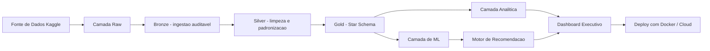
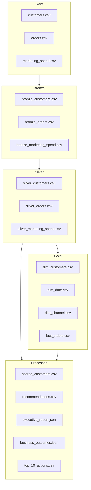
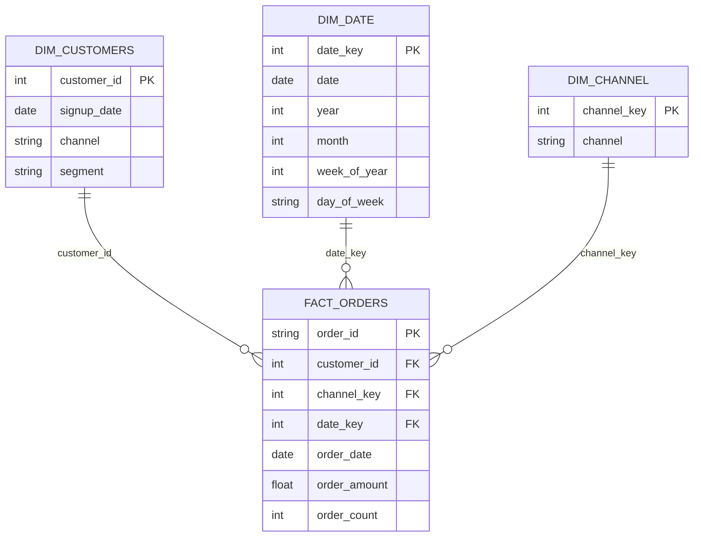
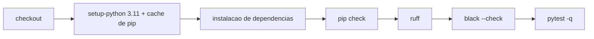
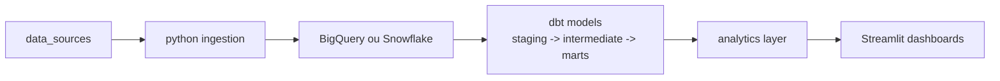

# Revenue Intelligence Platform - Sistema Executivo de Analitica e ML (PT-PT)

[](https://www.python.org/)
[](https://streamlit.io/)
[](https://scikit-learn.org/)
[](https://www.docker.com/)
[](LICENSE)

## Idioma
- English: [README.md](README.md)
- Portugues (BR): [README.pt-BR.md](README.pt-BR.md)
- Portugues (PT): [README.pt-PT.md](README.pt-PT.md)

## Preview do Produto


## Qual Problema Resolve

- Times comerciais precisam de uma carteira priorizada única para retenção, upsell e racionalização.
- Finanças e growth precisam de unit economics (`LTV/CAC`) por canal para realocar verba rapidamente.
- Liderança precisa de um board pack semanal com KPIs, sinais de risco e ações prioritárias.

## Sumário

- [Preview do Produto](#preview-do-produto)
- [Qual Problema Resolve](#qual-problema-resolve)
- [App em Produção](#app-em-produ%C3%A7%C3%A3o)
- [Resumo Executivo](#resumo-executivo)
- [Resultados de Negócio](#resultados-de-neg%C3%B3cio)
- [Escopo e Capacidades](#escopo-e-capacidades)
- [Arquitetura](#arquitetura)
- [Linhagem de Dados](#linhagem-de-dados)
- [Estrutura do Repositório](#estrutura-do-reposit%C3%B3rio)
- [Fonte de Dados](#fonte-de-dados)
- [Star Schema (Gold)](#star-schema-gold)
- [Organização SQL](#organiza%C3%A7%C3%A3o-sql)
- [Como Rodar (Windows / PowerShell)](#como-rodar-windows--powershell)
- [CLI](#cli)
- [Qualidade de Engenharia](#qualidade-de-engenharia)
- [CI](#ci)
- [Docker](#docker)
- [Principais Saídas](#principais-sa%C3%ADdas)
- [Streamlit Cloud](#streamlit-cloud)

## App em Produção

Streamlit Cloud:
- https://revenue-intelligence-platform.streamlit.app/

## Resumo Executivo

A Revenue Intelligence Platform é um sistema de decisão comercial de ponta a ponta que transforma dados de comportamento em prioridades executivas.

Esta versão inclui uma arquitetura de dados madura em camadas (`raw -> bronze -> silver -> gold`) com Star Schema formal e domínios SQL estruturados para analytics.

## Resultados de Negócio

- Carteira priorizada com impacto financeiro estimado
- Eficiência por canal com `LTV/CAC` e unit economics
- Sinalização de risco de churn e nova compra por cliente
- Narrativa executiva para rituais semanais de gestão

## Escopo e Capacidades

- Ingestão de dados com fonte Kaggle e fallback sintético
- Pipeline em camadas: raw, bronze, silver, gold
- Engenharia de features e scoring por cliente
- Saídas em Star Schema para analytics
- Camada de KPIs: LTV, CAC, RFM, Coorte, Unit Economics
- Camada de ML: churn e nova compra
- Motor de recomendação de próxima melhor ação
- Dashboard executivo com governança e exportação
  (`Executive Overview`, `Risk & Growth`, `Action List`)

## Arquitetura



## Linhagem de Dados



## Estrutura do Repositório

```text
revenue-intelligence-platform/
|- app/
|  \- streamlit_app.py
|- data/
|  |- raw/
|  |- bronze/
|  |- silver/
|  |- gold/
|  \- processed/
|- notebooks/
|- src/
|- sql/
|  |- ddl/
|  \- analytics/
|- main.py
|- requirements.txt
|- requirements-dev.txt
|- pytest.ini
|- Dockerfile
|- README.md
\- README.pt-BR.md
```

## Fonte de Dados

Arquivo principal:
- `data/raw/E-commerce Customer Behavior - Sheet1.csv`

Fonte:
- Dataset Kaggle: `E-commerce Customer Behavior Dataset`

Mapeado automaticamente para:
- `customers.csv`
- `orders.csv`
- `marketing_spend.csv`

Depois normalizado em:
- `data/bronze/*.csv`
- `data/silver/*.csv`
- `data/gold/dim_*.csv` e `data/gold/fact_*.csv`

## Star Schema (Gold)

- Dimensões: `dim_date`, `dim_customers`, `dim_channel`
- Fato: `fact_orders`
- Medidas padronizadas: `order_amount`, `order_count`



## Organização SQL

- `sql/ddl/`: scripts de criação de schema por tabela/domínio
- `sql/analytics/`: queries executivas (KPIs de receita, eficiência por canal, watchlist de churn)
- `sql/create_tables.sql`: script consolidado de bootstrap

## Como Rodar (Windows / PowerShell)

```powershell
py -3.11 -m venv .venv
.\.venv\Scripts\activate
python -m pip install --upgrade pip
python -m pip install -r requirements.txt
python main.py
python -m streamlit run .\app\streamlit_app.py
```

Sobrescritas via ambiente:
- `RIP_DATA_DIR`
- `RIP_SEED`
- `RIP_LOG_LEVEL`
- `RIP_APP_LANG_MODE` (`bilingual` ou `international`)

## CLI

```powershell
python -m src.pipeline run
python -m src.pipeline run --seed 123 --log-level DEBUG
```

## Qualidade de Engenharia

```powershell
.\.venv\Scripts\python.exe -m pip install -r requirements-dev.txt
.\.venv\Scripts\python.exe -m black .
.\.venv\Scripts\python.exe -m ruff check . --fix
.\.venv\Scripts\python.exe -m pytest -q
pre-commit install
pre-commit run --all-files
```

Gates atuais de qualidade:
- `tests/test_output_contract.py` valida geração dos arquivos de saída e colunas mínimas do schema Gold.
- `main.py` inicializa a execução com `PipelineConfig.from_env(...)` para configuração determinística.

## Docker

```bash
docker build -t revenue-intelligence .
docker run -p 8501:8501 revenue-intelligence
```

## Principais Saídas

- `data/processed/scored_customers.csv`
- `data/processed/recommendations.csv`
- `data/processed/cohort_retention.csv`
- `data/processed/unit_economics.csv`
- `data/processed/executive_report.json` (relatório principal do app com KPIs, métricas de modelo e top 20 ações)
- `data/processed/executive_summary.json` (resumo executivo compacto)
- `data/processed/business_outcomes.json` (KPIs de negócio, LTV/CAC por canal e simulação baseline vs cenário)
- `data/processed/top_10_actions.csv` (top 10 ações priorizadas com uplift, custo, net impact e ROI simulado)
- `data/processed/metrics_report.json` (artefato auxiliar de métricas de ML)
- `data/processed/dim_customers.csv`
- `data/processed/dim_date.csv`
- `data/processed/dim_channel.csv`
- `data/processed/fact_orders.csv`

## CI

Workflow GitHub Actions em `.github/workflows/ci.yml` executa:
- `pip check` (consistência de dependências)
- `ruff`
- `black --check`
- `pytest -q`

Robustez do pipeline:
- cache de pip habilitado via `actions/setup-python`
- `concurrency` habilitado (`cancel-in-progress: true`)
- permissões mínimas no workflow (`contents: read`)



## Streamlit Cloud

- Caminho do arquivo principal: `app/streamlit_app.py`
- Arquivo de dependências: `requirements.txt`
- CSV do Kaggle versionado em `data/raw/` para execuções determinísticas na cloud
- Modo de idioma da aplicação:
  - `RIP_APP_LANG_MODE=bilingual`: seletor com `Portuguese (BR)` e `International (EN)`
  - `RIP_APP_LANG_MODE=international`: app bloqueado apenas em inglês


## Arquitetura Modern Data Stack



## Warehouse + dbt

- Projeto dbt com camadas: `staging`, `intermediate`, `marts`
- Carga opcional no warehouse via variavel `RIP_WAREHOUSE_PROVIDER`
- Targets suportados: `bigquery` e `snowflake`

Variaveis de ambiente:
- `RIP_WAREHOUSE_PROVIDER` (`none`, `bigquery`, `snowflake`)
- `RIP_WAREHOUSE_DATASET`
- `RIP_WAREHOUSE_SCHEMA`
- `RIP_BQ_PROJECT`, `RIP_BQ_LOCATION`
- `RIP_SF_ACCOUNT`, `RIP_SF_USER`, `RIP_SF_PASSWORD`, `RIP_SF_WAREHOUSE`, `RIP_SF_DATABASE`, `RIP_SF_ROLE`

## Demo em Um Comando

```powershell
powershell -ExecutionPolicy Bypass -File .\scripts\run_modern_data_stack_demo.ps1
```

Com BigQuery + dbt:

```powershell
powershell -ExecutionPolicy Bypass -File .\scripts\run_modern_data_stack_demo.ps1 -Target bigquery -RunDbt
```

Com Snowflake + dbt:

```powershell
powershell -ExecutionPolicy Bypass -File .\scripts\run_modern_data_stack_demo.ps1 -Target snowflake -RunDbt
```

## Atualizacao CI e Docs dbt

- URL publicada dos docs: https://samuelmaia-analytics.github.io/revenue-intelligence-platform-suite/
- Workflow de publicacao: `.github/workflows/dbt-docs.yml`
- Validacao no CI: job `dbt-parse` em `.github/workflows/ci.yml`
